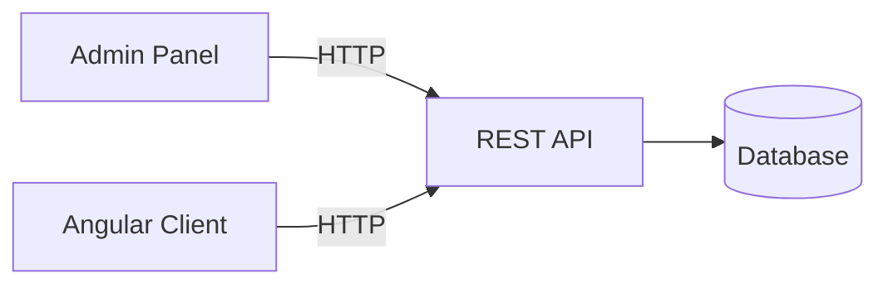
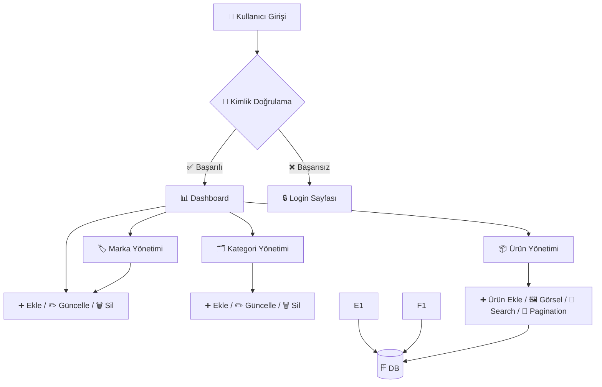

# 🛒 E-Commerce Platform (Multi-Tenant) — Admin Panel + REST API + Angular Storefront

> Bu proje; farklı şirketlerin kendi e-ticaret operasyonlarını yönetebildiği **çok katmanlı bir E-Ticaret Servis Platformu**dur.  
> Mimari; **REST API (çekirdek köprü)** üzerine kuruludur. Hem **Admin Panel** (şirket yönetimi) hem de **Angular Storefront** tüm veriye **API üzerinden** erişir. 

---

## 🎯 Proje Amacı

- Kurumsal düzeyde **Admin Panel (Company Management)** geliştirmek  
- Modern standartlara uygun **REST API** üretmek (JWT, Role Based, Swagger, DTO, AutoMapper, Validation, Logging) 
- **Angular** ile kullanıcıya yönelik **storefront** geliştirmek (auth guard, interceptor, lazy loading, search, pagination, responsive) 
- **Clean / Layered Architecture** yaklaşımını tek projede uçtan uca deneyimlemek

---

## 🧩 Genel Bakış

Bu repo 3 ana parçadan oluşur:

1. **REST API** → Sistemin çekirdeği / veri köprüsü  
2. **Admin Panel** → Şirketlerin ürün, kategori, marka, sipariş, müşteri vb. yönetimi  
3. **Client Application (Angular)** → Müşterinin alışveriş yaptığı storefront

📌 **Tek veri kapısı REST API’dir.** Admin Panel ve Angular Client doğrudan veritabanına bağlanmaz; yalnızca API tüketir. 

---

## 🧠 Mimari Yaklaşım

Bu proje, REST API’yi merkez alan, istemcilerin (Admin Panel + Angular Client) API üzerinden sisteme eriştiği çok katmanlı (Clean / Layered) mimari ile tasarlanmıştır.

### 1) Solution Yapısı

Proje **katmanlı mimari (layered architecture)** prensiplerine uygun olarak geliştirilmiştir.
```
E-Commerce/
├── ECommerce_RestApi/                       → REST API (Sistemin çekirdeği / köprü)
│   └── src/
│       ├── Core/
│       │   ├── ECommerce.Application/      → UseCase’ler, DTO, Interfaces, Helpers, Mappings, JWT
│       │   └── ECommerce.Domain/           → Entity’ler, Domain Interfaces, kurallar
│       ├── Infrastructure/                → DbContext, Migration, Repository, Service Implementations
│       └── Presentation/                  → Controllers, Filters, Middlewares, Attributes, Swagger, Config
│
├── ECommerce_AdminPanel/  → Admin UI (ASP.NET Core / Razor Pages veya MVC UI)
│   ├── Pages/Views/Controllers   → UI katmanı
│   ├── Services                  → API tüketen servisler / UI business
│   └── ...                       → Layout, static, helpers
│
└── ECommerce_ClientApplication/  → Client UI (Angular)
    └── src/
        ├── app/
        │   ├── core/             → auth, guards, interceptors, api services
        │   ├── features/         → ürünler, sepet, sipariş vb.
        │   ├── shared/           → ortak component/pipes
        │   └── layout/           → header/footer/shell
        └── environments/         → api base url vb.

```

## 2) Katmanların Sorumlulukları
### ✅ Domain (Core/Domain)

- Sistemin iş kuralları, entity modelleri
- Bağımlılık almaz, “en saf” katmandır

### ✅ Application (Core/Application)

- Use-case odaklı iş akışları
- DTO’lar, interface sözleşmeleri, mapping profilleri
- Auth/JWT, helper yapıları (gerekli olanlar)

“Ne yapılacak?” burada tanımlanır

### ✅ Infrastructure

“Nasıl yapılacak?” kısmı

- EF Core DbContext, Migration’lar, Repository implementasyonları
- Harici servis / veri erişim implementasyonları

### ✅ Presentation (REST API)

- Controller’lar ile HTTP endpointleri
- Authorization/Filters/Middlewares
- Swagger ve API konfigürasyonları

İstemcilerin tek giriş kapısı

##  3) İstemci Uygulamalar
### ✅ Admin Panel (ASP.NET Core UI)

- Admin / CompanyManager / Staff gibi rollerin yönetim ekranı
- Ürün/Kategori/Marka/Sipariş vb. CRUD işlemleri
- Veriye erişmek için doğrudan DB’ye değil API’ye gider
- Role-based ekran ve aksiyon yönetimi

### ✅ Client Application (Angular)

- Müşterinin alışveriş yaptığı arayüz
- Ürün listeleme, detay, sepet, sipariş süreçleri
- Tüm işlemler için REST API üzerinden iletişim kurar

##  4) Temel Prensip

📌 Tek veri kapısı REST API’dir.
AdminPanel ve Angular Client DB’ye doğrudan erişmez, sadece API tüketir.
Bu yaklaşım; güvenlik, ölçeklenebilirlik ve bakım kolaylığı sağlar.

---

📌 **UI → Service → DbContext** zinciri korunur  
📌 Razor Pages doğrudan DbContext’e erişmez  
📌 Tüm işlemler kullanıcı bazlı filtrelenir

---

## 🔐 Kimlik Doğrulama & Güvenlik (Admin Panel Tarafı)

- Cookie tabanlı authentication
- `ClaimTypes.NameIdentifier` ile kullanıcı tanımlama
- Şirket sahibi veya personel yalnızca **kendi markalarını, kategorilerini ve ürünlerini** görür
- Multi-tenant veri izolasyonu

---

# 🧩 Modüller & Özellikler

Aşağıdaki modüller hem Admin Panel hem de REST API tarafında (ilgili rollere göre) kurgulanmıştır: 

### Admin Panel (Şirket Yönetimi)

- Dashboard (toplam ürün/kullanıcı/sipariş/yorum)
- Ürün Yönetimi (listeleme, ekleme, güncelleme, silme, marka/kategori bağlama)
- Kategori Yönetimi (CRUD)
- Marka Yönetimi (CRUD)
- Sipariş Yönetimi (durum güncelleme, iptal/iade/kargo)
- Müşteri Yönetimi
- Yorum Yönetimi
- Kargo Ayarları
- Genel Ayarlar
- Kullanıcı & Rol Yönetimi
- Banner/Slider, ürün görsel yönetimi

### REST API (Sistemin çekirdeği)
- Products (Pagination + Search)
- Categories, Brands
- Customers
- Orders (status update, refund, cancel, tracking)
- Reviews
- Banners
- Admin Users & Roles
- Standart response formatı:
  
```json
{ "success": true, "message": "", "data": {} 
```

### Angular Storefront

- Anasayfa + slider
- Kategoriye göre ürün listeleme
- Ürün detay
- Sepet yönetimi
- Üye kayıt & giriş (JWT)
- Profil & adres yönetimi
- Checkout / sipariş oluşturma
- Sipariş geçmişi
- Yorum ekleme
- 404 / 500 hata sayfaları
- Global exception interceptor, loading spinner, pagination, search, responsive zorunlulukları 

## 🔐 Güvenlik

### REST API
- JWT Authentication
- Role Based Authorization
- Şirket bazlı API Key desteği 
- Global Exception Handling Middleware + Logging (Serilog vb.) + Swagger zorunlu 

### Admin Panel
- Session / Cookie tabanlı oturum yönetimi
- Sayfa/rol bazlı yetkilendirme
- Validation + Custom Error Handling zorunlu 


### Angular
- JWT login
- Auth Guard + Role Guard
- Auth Interceptor (token ekleme)
- Global Exception Interceptor 

---

## ⚙️ Kullanılan Teknolojiler

| Katman | Teknoloji |
|------|-----------|
| REST API | ASP.NET Core Web API, EF Core, AutoMapper, Swagger, JWT, Middleware |
| Admin Panel | ASP.NET Core MVC, Bootstrap 5 |
| FrontEnd | Angular, Guards, Interceptors, Lazy Loading |
| Veritabanı | SQLite |
| Auth | Cookie Authentication |
| Session | ASP.NET Session |

---

## 🚀 Kurulum & Çalıştırma

### 🧩 REST API — Kurulum
```bash
# Repo'yu klonla
git clone https://github.com/tubanursmsk/E-Commerce.git
cd E-Commerce

# Bağımlılıkları yükle
dotnet restore

# Veritabanını oluştur
dotnet ef database update

# Uygulamayı çalıştır
dotnet run
```

```arduino
http://localhost:5271
```

### 🧩 Admin Panel — Kurulum
```bash
cd AdminPanel
dotnet restore
dotnet run
```
```arduino
http://localhost:5176
```
- Admin Panel, veri işlemleri için REST API’ye istek atar (tasarım/kurgu bu şekildedir).

### 🧩 Angular Client — Kurulum
```bash
cd FrontEnd
npm install
ng serve
```
```arduino
http://localhost:4200
```

## 🗄️ Veritabanı

- SQLite kullanılmıştır
- EF Core migrations desteklidir
- Her tablo UserId ile filtrelenir (multi-tenant yapı)

---

## 👥 Demo Hesaplar

| Rol             | Email                  | Şifre   | 
|-----------------|------------------------|---------|
| Admin           | ali@mail.com           | Aa12345 |
| CompanyManager  | hasan@mail.com         | Aa12345 |
| Staff           | veli@mail.com          | Aa12345 |
| Customer        | metehanpolat@mail.com  | Aa12345 |

---

## 📌 API Endpointleri (Özet)

- Aşağıdaki tablo proje yönergesindeki zorunlu modülleri temsil eder. Kesin endpoint rotaları için Swagger esas alınır.
  
| Modül               | Açıklama                                   |
| ------------------- | ------------------------------------------ |
| Auth                | JWT Login/Register/Profile                 |
| Products            | Pagination + Search + CRUD                 |
| Categories          | CRUD                                       |
| Brands              | CRUD                                       |
| Customers           | CRUD                                       |
| Orders              | Status update / refund / cancel / tracking |
| Reviews             | CRUD                                       |
| Banners             | CRUD                                       |
| Admin Users & Roles | RBAC yönetimi                              |

---

## 🔄 İş Akışı (Flow Diagram)

### Sistem Seviyesi Akış (AdminPanel + Client → API → DB)


### Admin Panel Akışı (Marka / Kategori / Ürün)


---


## 🖼️ Ekran Görüntüleri / Videolar

### Swagger - Rest API Dokümantasyonu


---


## 👩‍💻 Admin Panel 

> ### Dashboard (toplam ürün/kullanıcı/sipariş/yorum)


  
> ### Ürün Yönetimi (listeleme, ekleme, güncelleme, silme, marka/kategori bağlama)


  


- Patron veya muhasebeci "Stok listesini bana at" dediğinde veritabanına gitmeye gerek kalmadan, tek tuşla (.xsln formatında) profesyonel bir rapor sunma imkanı! 🚀
  


> ### Kategori Yönetimi (CRUD)


> ### Marka Yönetimi (CRUD)


> ### Sipariş Yönetimi (durum güncelleme, iptal/iade/kargo)


> ### Müşteri Yönetimi


> ### Yorum Yönetimi


> ### Kargo Ayarları


> ### Kullanıcı & Rol Yönetimi


> ### Banner/Slider, ürün görsel yönetimi


> ### Şirket Ayarları


> ### Profil Ayarları


> ### Müşteri kayıt & giriş (JWT)


---


## 🧩 Angular Client

> ### Anasayfa + slider
[Macbook-Air-localhost-yy_8cjr47hc7_n.webm](https://github.com/user-attachments/assets/2eae17c9-14fa-4139-81ed-beb4aa70dc83)

[Macbook-Air-localhost-5943v4ms2e1a5y.webm](https://github.com/user-attachments/assets/b407c5de-fa0c-4fe6-a92f-1fa5df5e5f4f)

> ### Kategoriye göre ürün listeleme

[Macbook-Air-localhost-tdr7wo63q2hy6z.webm](https://github.com/user-attachments/assets/6f2cfcfd-e898-44e3-850d-2f6f1e17991c)

> ### Ürün detay


[Macbook-Air-localhost-a0mcx42v2-k0s9.webm](https://github.com/user-attachments/assets/fbe286b6-1eb3-478d-8d63-75685dbbb274)

> ### Sepet yönetimi


> ### Üye kayıt & giriş (JWT)


> ### Profil & adres yönetimi


> ### Checkout / sipariş oluşturma


> ### Sipariş geçmişi


> ### Yorum ekleme


> ### 404 / 500 hata sayfaları


---


> ## 🎓 Öğrenme Kazanımları
- Katmanlı mimariyi (Core/Application/Domain + Infrastructure + Presentation) gerçek proje üstünde uygulama
- Admin Panel + API + Angular istemci entegrasyonu
- JWT / Session / Role Based Authorization pratikleri
- Global exception handling + logging + validation standartları

---

## 👩‍💻 Geliştirici
**Tuba Nur Şimşek** (Software Developer)

```bash
🔗 GitHub: https://github.com/tubanursmsk
```

---

## 🧾 Lisans

MIT License © 2025 — tubanursmsk

---

> ## 🏷️ Etiketler
`.NET Razor Pages Entity Framework Core SQLite`
`Admin Panel E-Commerce Multi-Tenant CRUD`
`Layered Architecture Bootstrap Backend Development` `C#`
`Console App` `Katmanlı Mimari` `ASP.Net Core`

