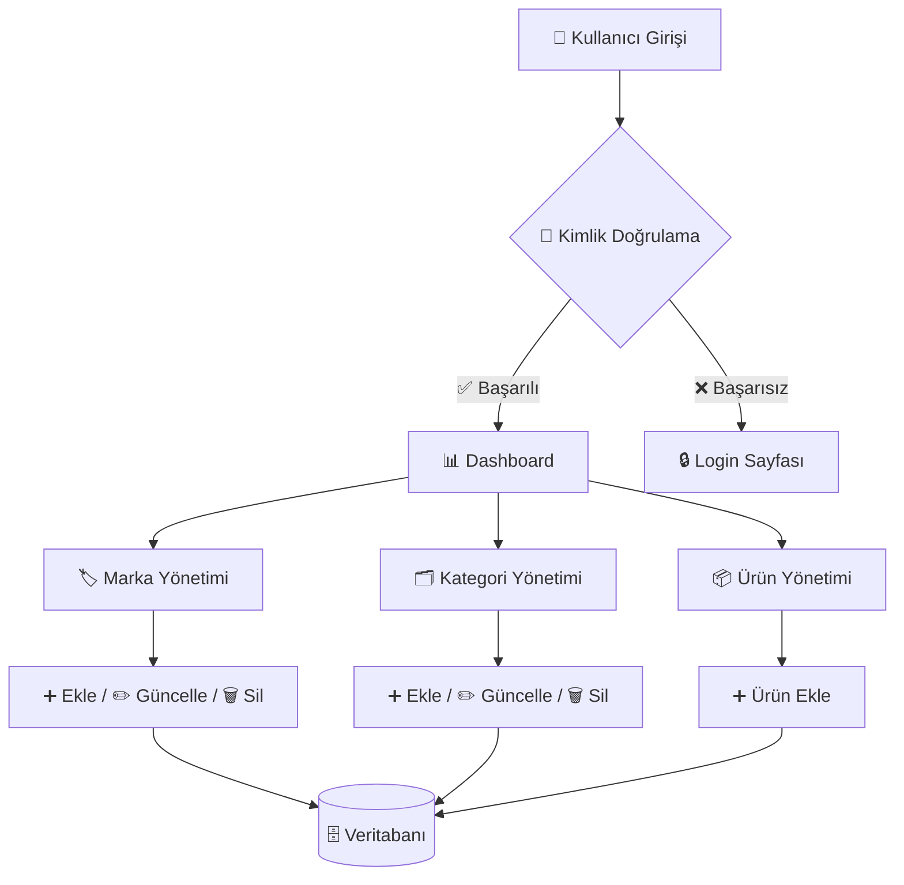

# 🛒 MultiStore E-Commerce Admin Panel

> **MultiStore E-Commerce Admin Panel**, .NET 8 ve Razor Pages kullanılarak geliştirilmiş,  
> **multi-tenant (çoklu kullanıcı)** yapıya sahip, modern ve ölçeklenebilir bir **e-ticaret yönetim panelidir**.  
> Proje; gerçek hayata uygun **admin panel mimarisi**, **katmanlı yapı** ve **servis tabanlı CRUD** yaklaşımıyla tasarlanmıştır.

---

## 🎯 Proje Amacı

Bu projenin temel amacı:

- Gerçek hayatta kullanılan **e-ticaret admin panellerine benzer** bir yapı kurmak  
- **Razor Pages** mimarisini doğru routing & handler mantığıyla uygulamak  
- Kullanıcı bazlı **veri izolasyonu (multi-tenant)** sağlamak  
- CRUD işlemlerini **Service katmanı** üzerinden yönetmek  
- UI, iş mantığı ve veri erişimini **net şekilde ayırmak**

---

## 🧠 Mimari Yaklaşım

Bu proje, REST API’yi merkez alan, istemcilerin (Admin Panel + Angular Client) API üzerinden sisteme eriştiği çok katmanlı (Clean / Layered) mimari ile tasarlanmıştır.

### 1) Solution Yapısı

Proje **katmanlı mimari (layered architecture)** prensiplerine uygun olarak geliştirilmiştir.
```
E-Commerce/
├── ECommerce_RestApi/                       → REST API (Sistemin çekirdeği / köprü)
│   └── src/
│       ├── Core/
│       │   ├── ECommerce.Application/      → UseCase’ler, DTO, Interfaces, Helpers, Mappings, JWT
│       │   └── ECommerce.Domain/           → Entity’ler, Domain Interfaces, kurallar
│       ├── Infrastructure/                → DbContext, Migration, Repository, Service Implementations
│       └── Presentation/                  → Controllers, Filters, Middlewares, Attributes, Swagger, Config
│
├── ECommerce_AdminPanel/  → Admin UI (ASP.NET Core / Razor Pages veya MVC UI)
│   ├── Pages/Views/Controllers   → UI katmanı
│   ├── Services                  → API tüketen servisler / UI business
│   └── ...                       → Layout, static, helpers
│
└── ECommerce_ClientApplication/  → Client UI (Angular)
    └── src/
        ├── app/
        │   ├── core/             → auth, guards, interceptors, api services
        │   ├── features/         → ürünler, sepet, sipariş vb.
        │   ├── shared/           → ortak component/pipes
        │   └── layout/           → header/footer/shell
        └── environments/         → api base url vb.

```

## 2) Katmanların Sorumlulukları
### ✅ Domain (Core/Domain)

- Sistemin iş kuralları, entity modelleri
- Bağımlılık almaz, “en saf” katmandır

### ✅ Application (Core/Application)

- Use-case odaklı iş akışları
- DTO’lar, interface sözleşmeleri, mapping profilleri
- Auth/JWT, helper yapıları (gerekli olanlar)

“Ne yapılacak?” burada tanımlanır

### ✅ Infrastructure

“Nasıl yapılacak?” kısmı

- EF Core DbContext, Migration’lar, Repository implementasyonları
- Harici servis / veri erişim implementasyonları

### ✅ Presentation (REST API)

- Controller’lar ile HTTP endpointleri
- Authorization/Filters/Middlewares
- Swagger ve API konfigürasyonları

İstemcilerin tek giriş kapısı

##  3) İstemci Uygulamalar
### ✅ Admin Panel (ASP.NET Core UI)

- Admin / CompanyManager / Staff gibi rollerin yönetim ekranı
- Ürün/Kategori/Marka/Sipariş vb. CRUD işlemleri
- Veriye erişmek için doğrudan DB’ye değil API’ye gider
- Role-based ekran ve aksiyon yönetimi

### ✅ Client Application (Angular)

- Müşterinin alışveriş yaptığı arayüz
- Ürün listeleme, detay, sepet, sipariş süreçleri
- Tüm işlemler için REST API üzerinden iletişim kurar

##  4) Temel Prensip

📌 Tek veri kapısı REST API’dir.
AdminPanel ve Angular Client DB’ye doğrudan erişmez, sadece API tüketir.
Bu yaklaşım; güvenlik, ölçeklenebilirlik ve bakım kolaylığı sağlar.

---

📌 **UI → Service → DbContext** zinciri korunur  
📌 Razor Pages doğrudan DbContext’e erişmez  
📌 Tüm işlemler kullanıcı bazlı filtrelenir

---

## 🔐 Kimlik Doğrulama & Güvenlik

- Cookie tabanlı authentication
- `ClaimTypes.NameIdentifier` ile kullanıcı tanımlama
- Kullanıcı yalnızca **kendi markalarını, kategorilerini ve ürünlerini** görür
- Multi-tenant veri izolasyonu

---

## 🧩 Fonksiyonel Özellikler

### 🏷️ Brand (Marka) Yönetimi
- Marka ekleme
- Marka listeleme
- Güncelleme
- Silme
- Kullanıcıya özel marka yönetimi

### 🗂️ Category (Kategori) Yönetimi
- Kategori CRUD işlemleri
- Ürünlerle ilişkilendirme altyapısı
- Kullanıcı bazlı kategori izolasyonu

### 📦 Product (Ürün) Yönetimi
- Ürün ekleme
- Marka & kategori seçimi
- Açıklama alanı
- Fiyat & stok yönetimi
- Kullanıcı bazlı ürün listeleme

### 📊 Admin Panel
- Bootstrap 5 tabanlı responsive tasarım
- Sidebar & navbar mimarisi
- Razor Pages uyumlu layout yapısı

---

## ⚙️ Kullanılan Teknolojiler

| Katman | Teknoloji |
|------|-----------|
| Backend | .NET 9 |
| UI | Razor Pages |
| ORM | Entity Framework Core |
| Veritabanı | SQLite |
| Mapping | AutoMapper |
| UI Framework | Bootstrap 5 |
| Auth | Cookie Authentication |
| Session | ASP.NET Session |

---

## 🚀 Kurulum & Çalıştırma

```bash
# Repo'yu klonla
git clone https://github.com/tubanursmsk/E-Commerce.git
cd E-Commerce

# Bağımlılıkları yükle
dotnet restore

# Veritabanını oluştur
dotnet ef database update

# Uygulamayı çalıştır
dotnet run
```

```arduino
http://localhost:5294
```

## 🗄️ Veritabanı

- SQLite kullanılmıştır
- EF Core migrations desteklidir
- Her tablo UserId ile filtrelenir (multi-tenant yapı)

---

## 🧪 Öğrenilen & Uygulanan Konular

✅ Razor Pages routing & handler mantığı
✅ ModelState ve form binding sorunlarının çözümü
✅ Cookie authentication & claims kullanımı
✅ Multi-tenant veri yönetimi
✅ Servis katmanı organizasyonu
✅ Admin panel UI – backend senkronizasyonu
✅ Gerçek hayata yakın CRUD senaryoları

---

## 🔄 İş Akışı (Flow Diagram)



---

## 👩‍💻 Geliştirici
**Tuba Nur Şimşek** (Software Developer)

```bash
🔗 GitHub: https://github.com/tubanursmsk
```
---

## 🧾 Lisans

MIT License © 2025 — tubanursmsk

---

## 🏷️ Etiketler

`.NET Razor Pages Entity Framework Core SQLite`
`Admin Panel E-Commerce Multi-Tenant CRUD`
`Layered Architecture Bootstrap Backend Development` `C#`
`Console App` `Katmanlı Mimari` `ASP.Net Core`


